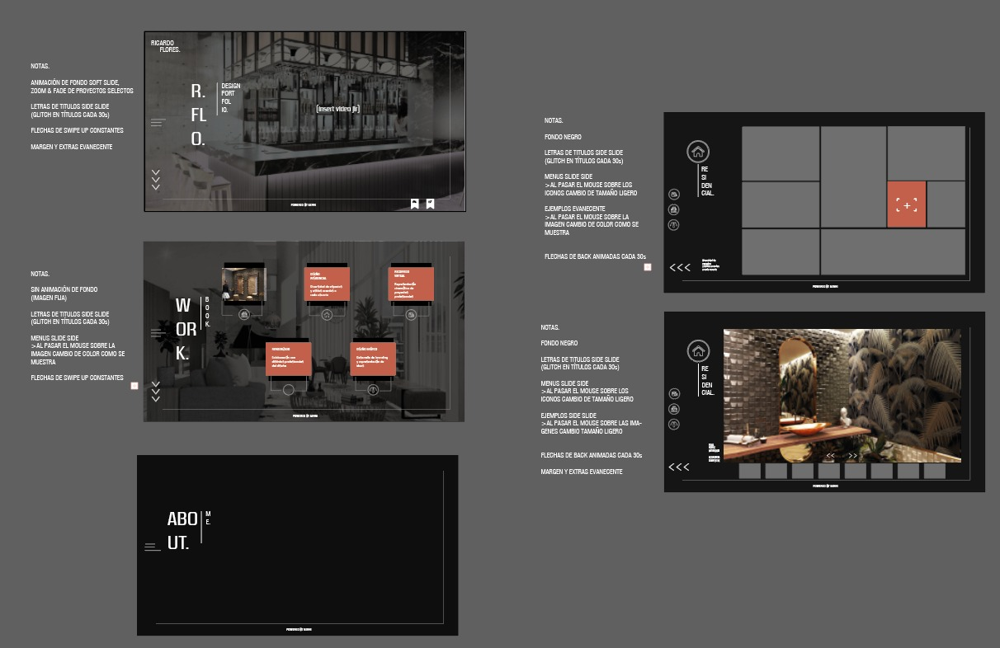

# ROFL
https://floresr.netlify.app

ROFL es un portafolio gráfico de trayectoria arquitectónica, incluye ejemplos de proyectos comerciales, residenciales e institucionales. Así mismo ejemplos de diversas colaboraciones de representación digital, tales como diseño gráfico, renderizado y recorridos virtuales.

